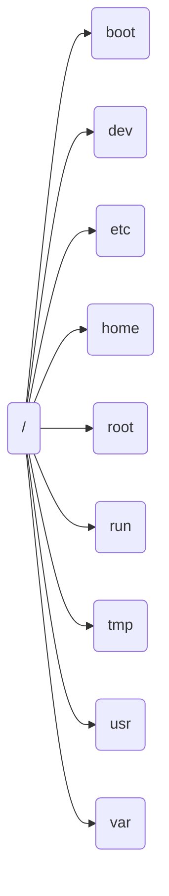

The File-system Hierarchy
The Linux system stores all files on file systems, which are organized into a single inverted tree known as a file-system hierarchy. This hierarchy is an inverted tree because the tree root is at the top, and the branches of directories and subdirectories stretch below the root.

The `/` directory is the root directory at the top of the file-system hierarchy. The `/` character is also used as a directory separator in file names. For example, if etc is a subdirectory of the `/` directory, then refer to that directory as `/etc`. Likewise, if the `/etc` directory contains a file that is named issue, then refer to that file as /etc/issue.

Subdirectories of `/` are used for standardized purposes to organize files by type and purpose to make it easier to find files. For example, in the root directory, the `/boot` subdirectory is used for storing files to boot the system.